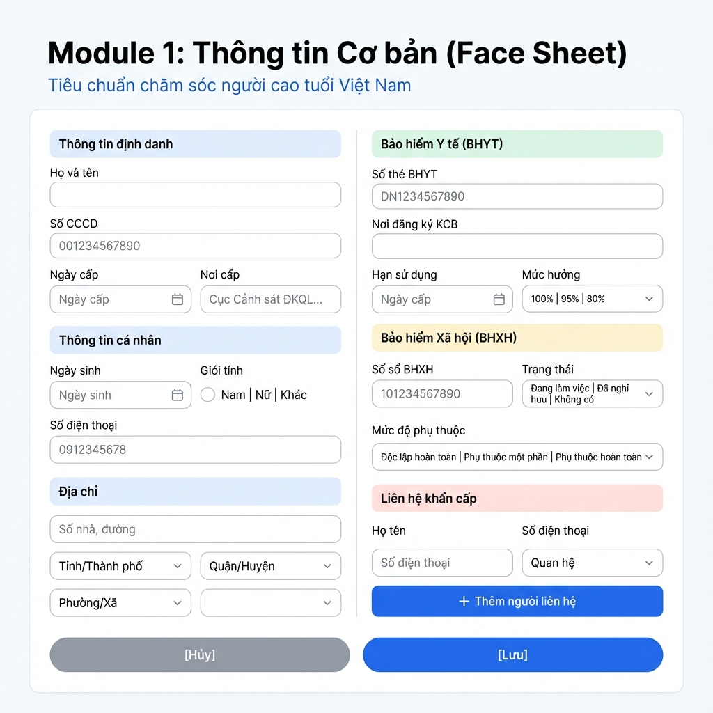
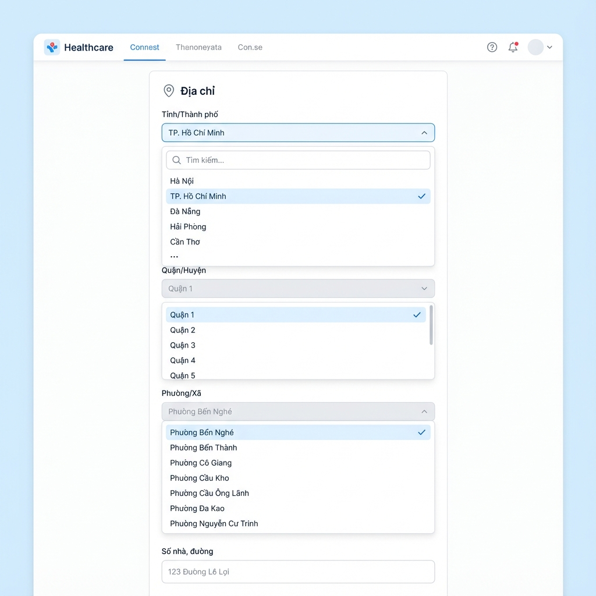
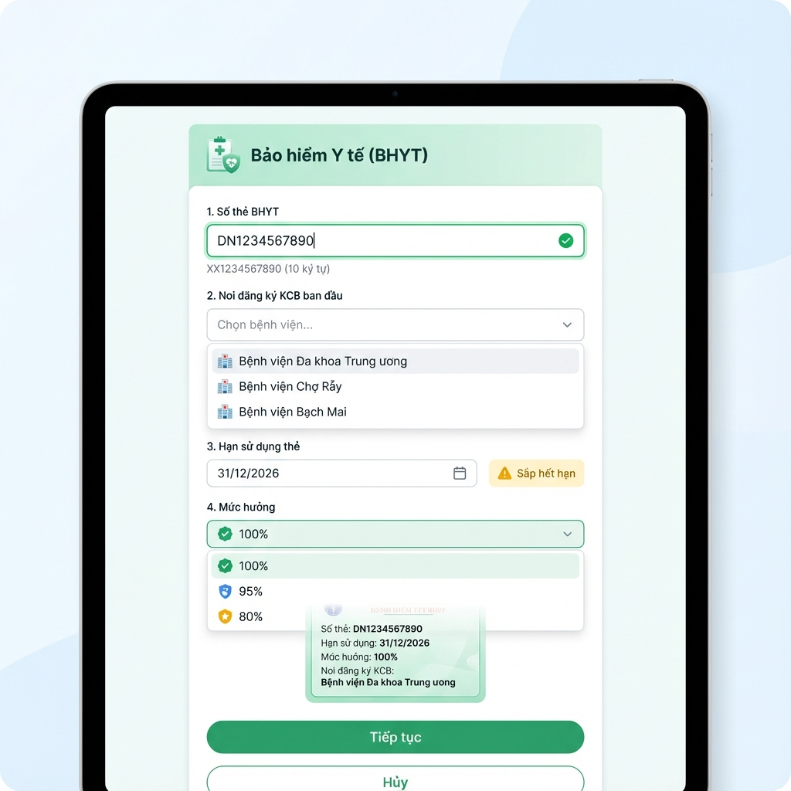
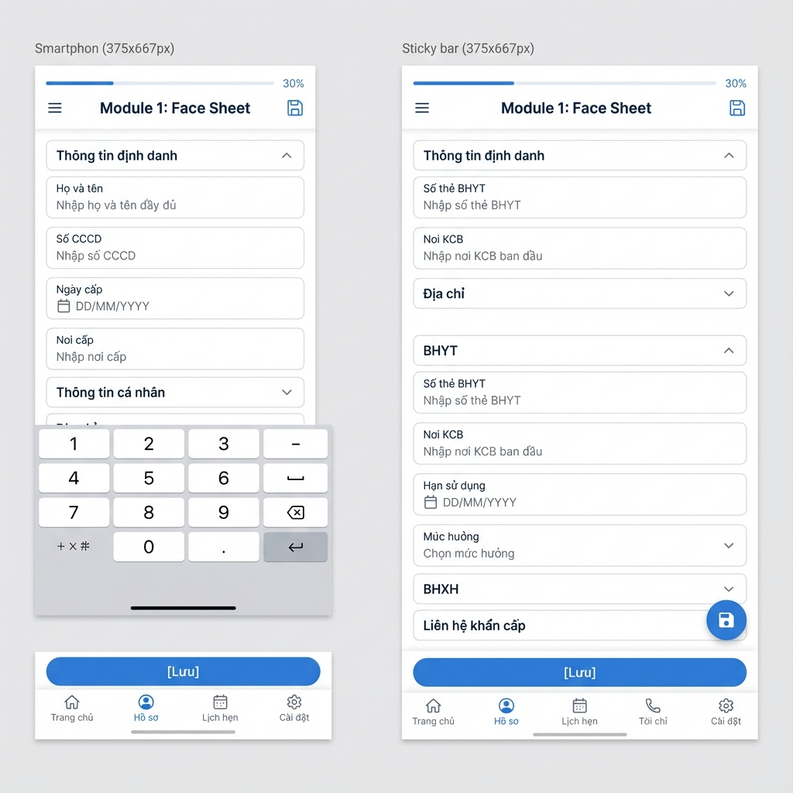
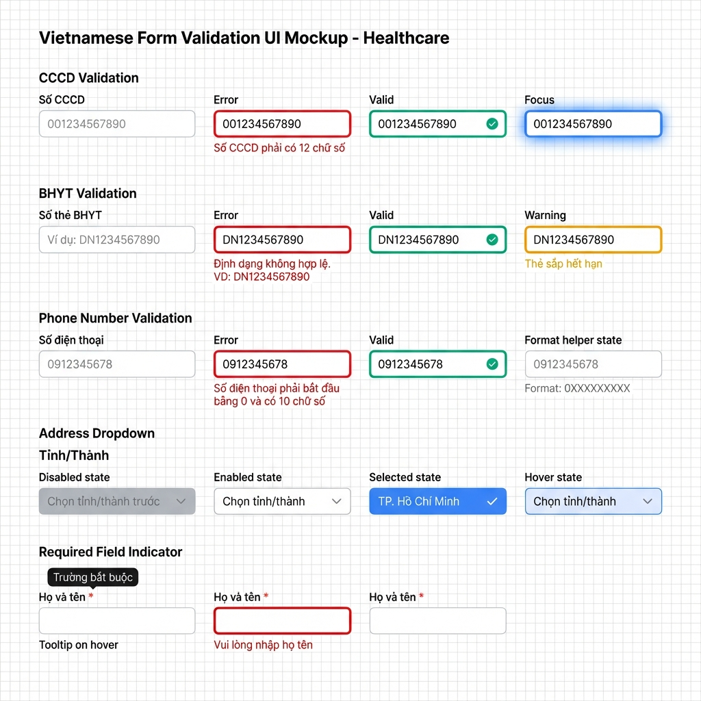

# UI Mockups - Module 1: Face Sheet (Vietnamese Version)

## 📱 Tổng quan

Tài liệu này trình bày các mockup UI cho Module 1 (Thông tin Cơ bản) đã được Việt Nam hóa, bao gồm các trường CCCD, BHYT, BHXH và địa chỉ có cấu trúc.

---

## 🖼️ Danh sách Mockups

### 1. Main Form Layout - Desktop

**Mô tả:**
- Layout 2 cột cho desktop
- Cột trái: Thông tin định danh, Thông tin cá nhân, Địa chỉ
- Cột phải: BHYT, BHXH, Mức độ phụ thuộc, Liên hệ khẩn cấp
- Section headers với màu sắc phân biệt
- Buttons Lưu/Hủy ở cuối form

**Điểm nổi bật:**
- ✅ Không có Furigana
- ✅ Có trường CCCD (12 chữ số)
- ✅ Có section BHYT riêng (màu xanh lá)
- ✅ Có section BHXH riêng (màu vàng)
- ✅ Địa chỉ với dropdown Tỉnh/Quận/Phường

---

### 2. Cascading Address Dropdowns

**Mô tả:**
- Hệ thống dropdown cascading cho địa chỉ Việt Nam
- Tỉnh/Thành phố → Quận/Huyện → Phường/Xã
- Search functionality trong dropdown
- Visual states: disabled, enabled, selected, hover

**Luồng hoạt động:**
1. User chọn Tỉnh/Thành phố (63 options)
2. Dropdown Quận/Huyện được enable
3. User chọn Quận/Huyện
4. Dropdown Phường/Xã được enable
5. User chọn Phường/Xã
6. User nhập Số nhà, đường

**Dữ liệu:**
- 63 Tỉnh/Thành phố
- ~700 Quận/Huyện
- ~10,000 Phường/Xã

---

### 3. BHYT Card Input with Validation

**Mô tả:**
- Section riêng cho Bảo hiểm Y tế (màu xanh lá)
- Real-time validation cho số thẻ BHYT
- Dropdown bệnh viện với autocomplete
- Date picker cho hạn sử dụng
- Dropdown mức hưởng với badges màu sắc
- Visual preview của thẻ BHYT

**Validation:**
- Số thẻ BHYT: 10 ký tự, format XX1234567890
- Green checkmark khi valid
- Red X khi invalid
- Yellow warning nếu sắp hết hạn

**Mức hưởng:**
- 100% (green badge)
- 95% (blue badge)
- 80% (yellow badge)

---

### 4. Mobile Responsive Design

**Mô tả:**
- Layout single column cho mobile
- Collapsible sections để tiết kiệm không gian
- Progress indicator (30% complete)
- Sticky bottom bar với button Lưu
- Touch-friendly (min 44x44px)
- Numeric keyboard cho CCCD, BHYT

**Sections:**
1. Thông tin định danh (expanded)
2. Thông tin cá nhân (collapsed)
3. Địa chỉ (collapsed)
4. BHYT (expanded)
5. BHXH (collapsed)
6. Liên hệ khẩn cấp (collapsed)

**Mobile-specific features:**
- Hamburger menu
- Bottom navigation
- Floating action button
- Swipe gestures
- Collapsible sections

---

### 5. Validation States

**Mô tả:**
- Comprehensive showcase của tất cả validation states
- 5 rows: CCCD, BHYT, Phone, Address, Required Field
- 4 states mỗi row: Empty, Error, Valid, Focus/Warning

**Color coding:**
- 🔴 Error: #ef4444 (red)
- 🟢 Success: #10b981 (green)
- 🟡 Warning: #f59e0b (yellow)
- 🔵 Info: #3b82f6 (blue)
- ⚪ Disabled: #9ca3af (gray)

**Error messages (Vietnamese):**
- CCCD: "Số CCCD phải có 12 chữ số"
- BHYT: "Định dạng không hợp lệ. VD: DN1234567890"
- Phone: "Số điện thoại phải bắt đầu bằng 0 và có 10 chữ số"
- Required: "Vui lòng nhập họ tên"

---

## 🎨 Design System

### Colors

| Element | Color | Hex Code |
|---------|-------|----------|
| Primary (Blue) | 🔵 | #2563eb |
| Success (Green) | 🟢 | #10b981 |
| Warning (Yellow) | 🟡 | #f59e0b |
| Error (Red) | 🔴 | #ef4444 |
| BHYT Section | 🟩 | #d1fae5 |
| BHXH Section | 🟨 | #fef3c7 |
| Emergency Section | 🟥 | #fee2e2 |

### Typography

- **Font Family:** Plus Jakarta Sans (sans-serif)
- **Heading:** 24px, Bold
- **Subheading:** 14px, SemiBold
- **Body:** 14px, Regular
- **Label:** 12px, Medium
- **Helper Text:** 11px, Regular

### Spacing

- **Section Gap:** 32px
- **Field Gap:** 16px
- **Padding (Section):** 24px
- **Padding (Input):** 12px 16px
- **Border Radius (Input):** 8px
- **Border Radius (Button):** 12px

### Input Fields

- **Height:** 44px (desktop), 48px (mobile)
- **Border:** 1px solid #e2e8f0
- **Border (Focus):** 2px solid #2563eb
- **Border (Error):** 2px solid #ef4444
- **Border (Valid):** 2px solid #10b981

---

## 📋 Implementation Checklist

### HTML Structure
- [ ] Create 2-column layout (desktop)
- [ ] Create single-column layout (mobile)
- [ ] Add section headers with colored backgrounds
- [ ] Add all input fields
- [ ] Add dropdown components
- [ ] Add date pickers
- [ ] Add radio buttons
- [ ] Add buttons (Lưu, Hủy, + Thêm)

### CSS Styling
- [ ] Implement color system
- [ ] Implement typography
- [ ] Implement spacing system
- [ ] Add responsive breakpoints
- [ ] Add hover states
- [ ] Add focus states
- [ ] Add validation states
- [ ] Add animations (fade in, slide)

### JavaScript Functionality
- [ ] CCCD validation (12 digits)
- [ ] BHYT validation (10 characters, format XX1234567890)
- [ ] Phone validation (10 digits, starts with 0)
- [ ] Cascading address dropdowns
- [ ] Real-time validation
- [ ] Form submission
- [ ] LocalStorage save/load
- [ ] Dynamic emergency contacts (add/remove)

### Data
- [ ] Load 63 tỉnh/thành phố
- [ ] Load quận/huyện by tỉnh
- [ ] Load phường/xã by quận
- [ ] Load danh sách bệnh viện
- [ ] Load quan hệ gia đình options

---

## 🔄 Responsive Breakpoints

| Device | Width | Layout |
|--------|-------|--------|
| Mobile | < 768px | Single column, collapsible |
| Tablet | 768px - 1024px | Single column, expanded |
| Desktop | > 1024px | Two columns |

---

## 🚀 Next Steps

1. **Implement HTML/CSS** - Code theo mockups
2. **Add JavaScript** - Validation và cascading dropdowns
3. **Test on devices** - Mobile, tablet, desktop
4. **User testing** - Thu thập feedback
5. **Iterate** - Cải thiện dựa trên feedback

---

## 📞 Feedback

Nếu có góp ý về UI/UX, vui lòng liên hệ design team.

**Design Lead:** [Name]  
**Email:** design@mirabocaresync.vn
