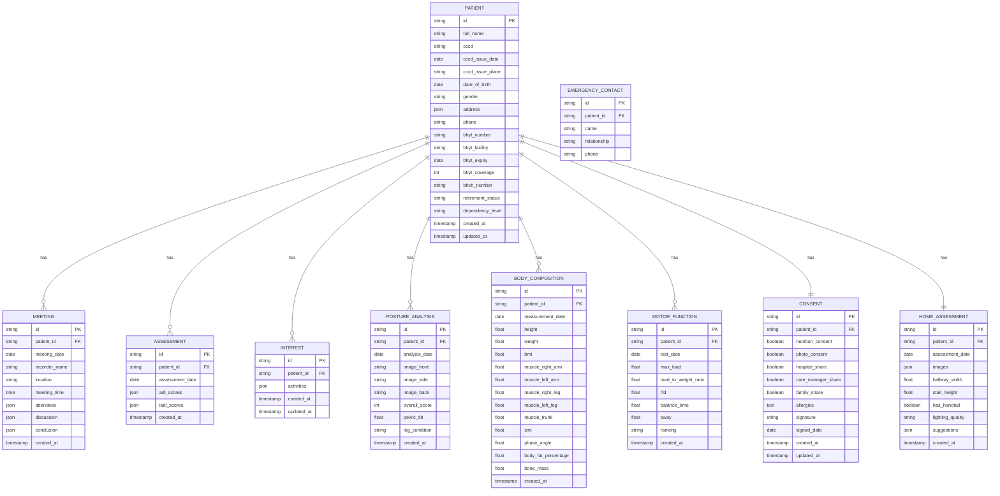

# Database Schema Design
## Hệ thống Quản lý Y tế Dưỡng Lão - MiraboCaresync

**Phiên bản:** 1.1 (Vietnam Edition)  
**Ngày:** 07/01/2026  
**Thị trường:** Việt Nam  
**Storage:** LocalStorage (Phase 1) → Database (Phase 2)

---

## 1. Tổng quan

Hệ thống sử dụng **LocalStorage** cho Phase 1 (prototype). Tài liệu này thiết kế schema để dễ dàng migrate sang database thực (MySQL/PostgreSQL) trong tương lai.

---

## 2. Entity Relationship Diagram (ERD)



---

## 3. LocalStorage Schema (Phase 1)

### 3.1. Root Structure

```javascript
{
  "mirabocaresync_data": {
    "patients": {
      "patient_001": { /* Patient object */ },
      "patient_002": { /* Patient object */ }
    },
    "settings": {
      "language": "vi",
      "theme": "light"
    },
    "metadata": {
      "version": "1.0",
      "last_backup": "2026-01-07T14:00:00Z"
    }
  }
}
```

### 3.2. Patient Object Structure

```javascript
{
  "id": "patient_001",
  "basicInfo": {
    "fullName": "Nguyễn Văn A",
    "cccd": "001234567890",
    "cccdIssueDate": "2020-01-15",
    "cccdIssuePlace": "Cục Cảnh sát ĐKQL cư trú và DLQG về dân cư",
    "dateOfBirth": "1945-05-15",
    "gender": "male",
    "address": {
      "street": "123 Đường Lê Lợi",
      "ward": "Phường Bến Nghé",
      "district": "Quận 1",
      "city": "TP. Hồ Chí Minh"
    },
    "phone": "0912345678",
    "bhyt": {
      "number": "DN1234567890",
      "facility": "Bệnh viện Đa khoa Trung ương",
      "expiry": "2026-12-31",
      "coverage": 100
    },
    "bhxh": {
      "number": "1234567890",
      "retirementStatus": "Đã nghỉ hưu"
    },
    "dependencyLevel": "Phụ thuộc một phần",
    "emergencyContacts": [
      {
        "id": "ec_001",
        "name": "Nguyễn Thị B",
        "relationship": "daughter",
        "phone": "0987-654-321"
      }
    ],
    "createdAt": "2026-01-01T10:00:00Z",
    "updatedAt": "2026-01-07T14:00:00Z"
  },
  
  "meetings": [
    {
      "id": "meeting_001",
      "meetingDate": "2026-01-05",
      "recorderName": "Trần Văn C",
      "location": "Phòng họp A",
      "meetingTime": "14:00",
      "attendees": [
        {
          "name": "Nguyễn Văn A",
          "role": "Người sử dụng dịch vụ"
        },
        {
          "name": "Nguyễn Thị B",
          "role": "Gia đình"
        },
        {
          "name": "Care Manager",
          "role": "Quản lý chăm sóc"
        }
      ],
      "discussion": {
        "familyWishes": "Mong muốn cải thiện khả năng di chuyển",
        "basicInfoConfirmed": true,
        "risksConfirmed": ["Tiểu đường", "Tăng huyết áp"]
      },
      "conclusion": {
        "startDate": "2026-01-10",
        "schedule": "Thứ 2, 4, 6 hàng tuần",
        "paymentMethod": "bank_transfer"
      },
      "createdAt": "2026-01-05T14:30:00Z"
    }
  ],
  
  "assessments": [
    {
      "id": "assessment_001",
      "assessmentDate": "2026-01-06",
      "adlScores": {
        "eating": 100,
        "transferring": 50,
        "hygiene": 100,
        "toileting": 50,
        "bathing": 50,
        "mobility": 50,
        "dressing": 100
      },
      "iadlScores": {
        "cooking": 100,
        "laundry": 50,
        "shopping": 50,
        "phone": 100,
        "finances": 100
      },
      "createdAt": "2026-01-06T10:00:00Z"
    }
  ],
  
  "interests": {
    "id": "interest_001",
    "activities": {
      "sports": {
        "walking": { "doing": true, "want": false, "interested": false },
        "exercise": { "doing": false, "want": true, "interested": false },
        "volleyball": { "doing": false, "want": false, "interested": true }
      },
      "arts": {
        "calligraphy": { "doing": false, "want": true, "interested": true },
        "painting": { "doing": false, "want": false, "interested": true }
      },
      "entertainment": {
        "karaoke": { "doing": true, "want": true, "interested": false },
        "movies": { "doing": false, "want": false, "interested": true }
      }
    },
    "createdAt": "2026-01-06T11:00:00Z",
    "updatedAt": "2026-01-06T11:00:00Z"
  },
  
  "postureAnalyses": [
    {
      "id": "posture_001",
      "analysisDate": "2026-01-06",
      "images": {
        "front": "data:image/png;base64,...",
        "side": "data:image/png;base64,...",
        "back": "data:image/png;base64,..."
      },
      "overallScore": 85,
      "pelvicTilt": 5.2,
      "legCondition": "normal",
      "createdAt": "2026-01-06T13:00:00Z"
    }
  ],
  
  "bodyCompositions": [
    {
      "id": "body_comp_001",
      "measurementDate": "2026-01-06",
      "height": 168,
      "weight": 65,
      "bmi": 23.0,
      "muscleMass": {
        "rightArm": 2.5,
        "leftArm": 2.4,
        "rightLeg": 8.2,
        "leftLeg": 8.0,
        "trunk": 25.3
      },
      "smi": 7.44,
      "phaseAngle": 4.75,
      "bodyFatPercentage": 22.5,
      "boneMass": 2.8,
      "createdAt": "2026-01-06T14:00:00Z"
    }
  ],
  
  "motorFunctions": [
    {
      "id": "motor_001",
      "testDate": "2026-01-06",
      "maxLoad": 45,
      "loadToWeightRatio": 69.2,
      "rfd": 850,
      "balanceTime": 25.5,
      "sway": 12.3,
      "ranking": "medium",
      "createdAt": "2026-01-06T15:00:00Z"
    }
  ],
  
  "consent": {
    "id": "consent_001",
    "nutritionConsent": true,
    "photoConsent": true,
    "hospitalShare": true,
    "careManagerShare": true,
    "familyShare": true,
    "allergies": "Dị ứng hải sản, đặc biệt là tôm",
    "signature": "data:image/png;base64,...",
    "signedDate": "2026-01-07",
    "createdAt": "2026-01-07T09:00:00Z",
    "updatedAt": "2026-01-07T09:00:00Z"
  },
  
  "homeAssessment": {
    "id": "home_001",
    "assessmentDate": "2026-01-05",
    "images": {
      "entrance": "data:image/png;base64,...",
      "livingRoom": "data:image/png;base64,...",
      "bathroom": "data:image/png;base64,...",
      "bedroom": "data:image/png;base64,...",
      "stairs": "data:image/png;base64,..."
    },
    "measurements": {
      "hallwayWidth": 120,
      "stairHeight": 18,
      "hasHandrail": false,
      "lightingQuality": "poor"
    },
    "suggestions": [
      "Lắp tay vịn tại cầu thang",
      "Cải thiện chiếu sáng tại hành lang",
      "Thêm thảm chống trượt tại nhà vệ sinh"
    ],
    "createdAt": "2026-01-05T16:00:00Z"
  }
}
```

---

## 4. Database Tables (Phase 2 - Future)

### 4.1. Table: patients

```sql
CREATE TABLE patients (
    id VARCHAR(50) PRIMARY KEY,
    full_name VARCHAR(100) NOT NULL,
    cccd VARCHAR(12) NOT NULL UNIQUE,
    cccd_issue_date DATE NOT NULL,
    cccd_issue_place VARCHAR(200) NOT NULL,
    date_of_birth DATE NOT NULL,
    gender ENUM('male', 'female', 'other') NOT NULL,
    address JSON NOT NULL,
    phone VARCHAR(10),
    bhyt_number VARCHAR(10),
    bhyt_facility VARCHAR(200),
    bhyt_expiry DATE,
    bhyt_coverage INT,
    bhxh_number VARCHAR(10),
    retirement_status ENUM('working', 'retired', 'none'),
    dependency_level ENUM('independent', 'partial', 'dependent') NOT NULL,
    created_at TIMESTAMP DEFAULT CURRENT_TIMESTAMP,
    updated_at TIMESTAMP DEFAULT CURRENT_TIMESTAMP ON UPDATE CURRENT_TIMESTAMP,
    INDEX idx_full_name (full_name),
    INDEX idx_cccd (cccd),
    INDEX idx_date_of_birth (date_of_birth)
);
```

### 4.2. Table: emergency_contacts

```sql
CREATE TABLE emergency_contacts (
    id VARCHAR(50) PRIMARY KEY,
    patient_id VARCHAR(50) NOT NULL,
    name VARCHAR(100) NOT NULL,
    relationship ENUM('son', 'daughter', 'spouse', 'grandchild', 'other') NOT NULL,
    phone VARCHAR(20) NOT NULL,
    FOREIGN KEY (patient_id) REFERENCES patients(id) ON DELETE CASCADE,
    INDEX idx_patient_id (patient_id)
);
```

### 4.3. Table: meetings

```sql
CREATE TABLE meetings (
    id VARCHAR(50) PRIMARY KEY,
    patient_id VARCHAR(50) NOT NULL,
    meeting_date DATE NOT NULL,
    recorder_name VARCHAR(100) NOT NULL,
    location VARCHAR(200),
    meeting_time TIME,
    attendees JSON,
    discussion JSON,
    conclusion JSON,
    created_at TIMESTAMP DEFAULT CURRENT_TIMESTAMP,
    FOREIGN KEY (patient_id) REFERENCES patients(id) ON DELETE CASCADE,
    INDEX idx_patient_id (patient_id),
    INDEX idx_meeting_date (meeting_date)
);
```

### 4.4. Table: assessments

```sql
CREATE TABLE assessments (
    id VARCHAR(50) PRIMARY KEY,
    patient_id VARCHAR(50) NOT NULL,
    assessment_date DATE NOT NULL,
    adl_scores JSON NOT NULL,
    iadl_scores JSON NOT NULL,
    created_at TIMESTAMP DEFAULT CURRENT_TIMESTAMP,
    FOREIGN KEY (patient_id) REFERENCES patients(id) ON DELETE CASCADE,
    INDEX idx_patient_id (patient_id),
    INDEX idx_assessment_date (assessment_date)
);
```

### 4.5. Table: body_compositions

```sql
CREATE TABLE body_compositions (
    id VARCHAR(50) PRIMARY KEY,
    patient_id VARCHAR(50) NOT NULL,
    measurement_date DATE NOT NULL,
    height DECIMAL(5,2) NOT NULL,
    weight DECIMAL(5,2) NOT NULL,
    bmi DECIMAL(4,2) GENERATED ALWAYS AS (weight / POWER(height/100, 2)) STORED,
    muscle_right_arm DECIMAL(4,2),
    muscle_left_arm DECIMAL(4,2),
    muscle_right_leg DECIMAL(4,2),
    muscle_left_leg DECIMAL(4,2),
    muscle_trunk DECIMAL(5,2),
    smi DECIMAL(4,2),
    phase_angle DECIMAL(4,2),
    body_fat_percentage DECIMAL(4,2),
    bone_mass DECIMAL(4,2),
    created_at TIMESTAMP DEFAULT CURRENT_TIMESTAMP,
    FOREIGN KEY (patient_id) REFERENCES patients(id) ON DELETE CASCADE,
    INDEX idx_patient_id (patient_id),
    INDEX idx_measurement_date (measurement_date)
);
```

---

## 5. Indexes & Performance

### 5.1. Recommended Indexes

```sql
-- Composite index for patient search
CREATE INDEX idx_patient_search ON patients(full_name, date_of_birth);

-- Index for timeline queries
CREATE INDEX idx_assessment_timeline ON assessments(patient_id, assessment_date DESC);
CREATE INDEX idx_body_comp_timeline ON body_compositions(patient_id, measurement_date DESC);
CREATE INDEX idx_motor_timeline ON motor_functions(patient_id, test_date DESC);
```

### 5.2. Query Optimization

**Lấy tất cả dữ liệu của 1 bệnh nhân:**
```sql
-- Optimized query với JOIN
SELECT 
    p.*,
    ec.name as emergency_contact_name,
    ec.phone as emergency_contact_phone,
    a.adl_scores,
    bc.bmi,
    bc.smi
FROM patients p
LEFT JOIN emergency_contacts ec ON p.id = ec.patient_id
LEFT JOIN assessments a ON p.id = a.patient_id
LEFT JOIN body_compositions bc ON p.id = bc.patient_id
WHERE p.id = 'patient_001'
ORDER BY a.assessment_date DESC, bc.measurement_date DESC
LIMIT 1;
```

---

## 6. Data Migration Plan

### 6.1. LocalStorage → Database

**Script migration:**
```javascript
async function migrateToDatabase() {
    const localData = JSON.parse(localStorage.getItem('mirabocaresync_data'));
    
    for (const [patientId, patientData] of Object.entries(localData.patients)) {
        // Insert patient
        await db.query('INSERT INTO patients SET ?', {
            id: patientId,
            full_name: patientData.basicInfo.fullName,
            furigana: patientData.basicInfo.furigana,
            // ... other fields
        });
        
        // Insert emergency contacts
        for (const contact of patientData.basicInfo.emergencyContacts) {
            await db.query('INSERT INTO emergency_contacts SET ?', contact);
        }
        
        // Insert assessments
        for (const assessment of patientData.assessments) {
            await db.query('INSERT INTO assessments SET ?', assessment);
        }
        
        // ... other tables
    }
}
```

---

## 7. Backup & Recovery

### 7.1. LocalStorage Backup

```javascript
function backupLocalStorage() {
    const data = localStorage.getItem('mirabocaresync_data');
    const blob = new Blob([data], { type: 'application/json' });
    const url = URL.createObjectURL(blob);
    const a = document.createElement('a');
    a.href = url;
    a.download = `backup_${new Date().toISOString()}.json`;
    a.click();
}
```

### 7.2. Restore from Backup

```javascript
function restoreFromBackup(file) {
    const reader = new FileReader();
    reader.onload = (e) => {
        const data = e.target.result;
        localStorage.setItem('mirabocaresync_data', data);
        alert('Khôi phục dữ liệu thành công!');
    };
    reader.readAsText(file);
}
```

---

## 8. Data Retention Policy

| Data Type | Retention Period | Archive After |
|-----------|------------------|---------------|
| Patient Basic Info | Permanent | N/A |
| Assessments | 5 years | 2 years |
| Body Compositions | 5 years | 2 years |
| Motor Functions | 5 years | 2 years |
| Meetings | 3 years | 1 year |
| Consent Forms | Permanent | N/A |
| Home Assessments | 2 years | 1 year |

---

## 9. Security Considerations

### 9.1. Data Encryption

**LocalStorage (Phase 1):**
```javascript
// Encrypt before saving
function saveEncrypted(key, data) {
    const encrypted = CryptoJS.AES.encrypt(
        JSON.stringify(data),
        'secret-key'
    ).toString();
    localStorage.setItem(key, encrypted);
}

// Decrypt when loading
function loadEncrypted(key) {
    const encrypted = localStorage.getItem(key);
    const decrypted = CryptoJS.AES.decrypt(encrypted, 'secret-key');
    return JSON.parse(decrypted.toString(CryptoJS.enc.Utf8));
}
```

### 9.2. Access Control

**Database (Phase 2):**
```sql
-- Create roles
CREATE ROLE admin;
CREATE ROLE staff;
CREATE ROLE viewer;

-- Grant permissions
GRANT ALL ON mirabocaresync.* TO admin;
GRANT SELECT, INSERT, UPDATE ON mirabocaresync.* TO staff;
GRANT SELECT ON mirabocaresync.* TO viewer;
```

---

## 10. Appendix

### 10.1. Sample Data

Xem file: `docs/architecture/sample_data.json`

### 10.2. Migration Scripts

Xem folder: `scripts/migration/`
