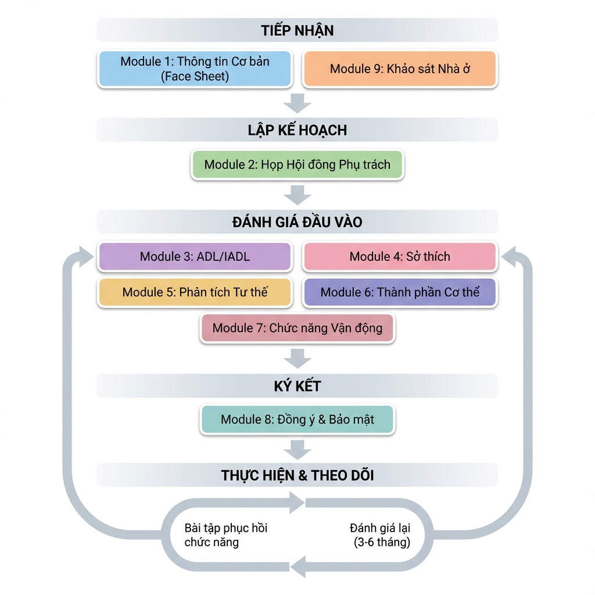
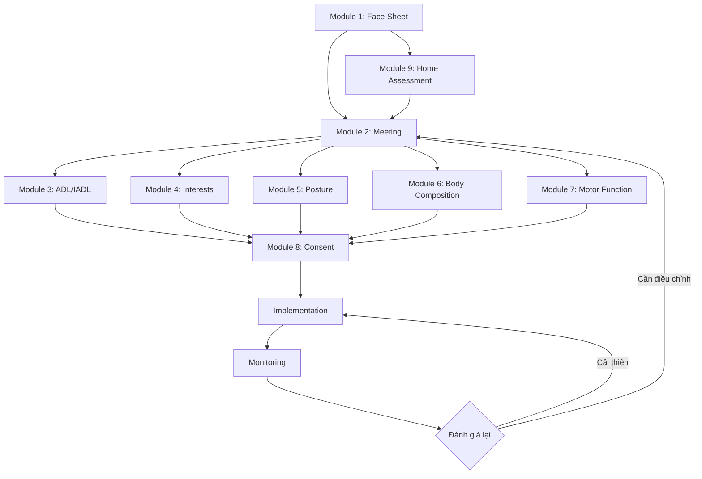

# Luồng Nghiệp vụ Hệ thống MiraboCaresync

## Sơ đồ Tổng quan

---

## 5 Giai đoạn Chính

### 🔵 Giai đoạn 1: TIẾP NHẬN (Intake)

**Mục tiêu:** Thu thập thông tin cơ bản và đánh giá môi trường sống ban đầu

**Thời gian:** 1-2 ngày

**Người thực hiện:** Nhân viên tiếp nhận + Care Manager

#### Module 1: Thông tin Cơ bản (Face Sheet)

**Nội dung thu thập:**
- Thông tin định danh (Họ tên, Furigana, Ngày sinh, Giới tính)
- Địa chỉ và thông tin liên lạc
- Người thân khẩn cấp
- Mức độ tự lập (Khuyết tật/Sa sút trí tuệ)
- Cấp độ chăm sóc (Hỗ trợ 1-2, Chăm sóc 1-5)
- Thời hạn chứng nhận bảo hiểm

**Đầu ra:**
- Hồ sơ cơ bản hoàn chỉnh
- Mã số người sử dụng (Patient ID)

#### Module 9: Khảo sát Nhà ở

**Nội dung thu thập:**
- Hình ảnh các khu vực (Lối vào, Phòng khách, Nhà vệ sinh, Phòng ngủ, Cầu thang)
- Đo đạc kích thước (Chiều rộng lối đi, Chiều cao bậc thang)
- Đánh giá an toàn (Tay vịn, Chiếu sáng, Bề mặt chống trượt)

**Đầu ra:**
- Báo cáo đánh giá nhà ở
- Danh sách gợi ý cải tạo

---

### 🟢 Giai đoạn 2: LẬP KẾ HOẠCH (Planning)

**Mục tiêu:** Thống nhất kế hoạch chăm sóc giữa các bên liên quan

**Thời gian:** 1 ngày

**Người thực hiện:** Cơ sở dưỡng lão + Gia đình + Care Manager

#### Module 2: Họp Hội đồng Phụ trách

**Nội dung cuộc họp:**
- Xác nhận thông tin cơ bản từ Module 1
- Thảo luận nguyện vọng của người sử dụng và gia đình
- Xác định các rủi ro và chống chỉ định
- Thống nhất dịch vụ cung cấp
- Quyết định lịch đưa đón và phương thức thanh toán

**Đầu ra:**
- Biên bản cuộc họp
- Ngày bắt đầu dịch vụ
- Kế hoạch chăm sóc ban đầu

---

### 🟣 Giai đoạn 3: ĐÁNH GIÁ ĐẦU VÀO (Initial Assessment)

**Mục tiêu:** Đo lường toàn diện khả năng và tình trạng sức khỏe

**Thời gian:** 2-3 ngày

**Người thực hiện:** Đội ngũ chuyên môn (PT, OT, Điều dưỡng)

#### Module 3: Đánh giá ADL/IADL

**Đánh giá ADL (Activities of Daily Living):**
1. Ăn uống
2. Chuyển vị trí (giường ↔ ghế)
3. Vệ sinh cá nhân
4. Đi vệ sinh
5. Tắm rửa
6. Di chuyển trong nhà
7. Thay đồ

**Đánh giá IADL (Instrumental ADL):**
1. Nấu ăn
2. Giặt giũ
3. Mua sắm
4. Sử dụng điện thoại
5. Quản lý tài chính

**Thang điểm:** Tự lập (100%) / Hỗ trợ một phần (50%) / Phụ thuộc hoàn toàn (0%)

**Đầu ra:** Biểu đồ Radar ADL/IADL

---

#### Module 4: Sở thích & Mối quan tâm

**Danh mục hoạt động (50+ items):**
- **Thể thao:** Đi bộ, Thể dục, Bóng chuyền, Golf, Bơi lội...
- **Nghệ thuật:** Thư pháp, Vẽ tranh, Làm gốm, Origami...
- **Giải trí:** Karaoke, Xem phim, Đọc sách, Nghe nhạc...
- **Xã hội:** Gặp gỡ bạn bè, Tình nguyện, Câu lạc bộ...
- **Khác:** Làm vườn, Nấu ăn, Du lịch, Chơi với thú cưng...

**Phân loại:**
- ✅ Đang làm
- 💭 Muốn làm
- 👀 Có quan tâm

**Đầu ra:** Danh sách hoạt động ưu tiên cho kế hoạch trị liệu

---

#### Module 5: Phân tích Tư thế

**Phương pháp:** Chụp ảnh tư thế (Front/Side/Back) + Phân tích bằng phần mềm

**Chỉ số đánh giá:**
- Điểm tổng quát (0-100)
- Độ nghiêng khung chậu (độ)
- Tình trạng chân (Bình thường / Chân chữ X / Chân chữ O)

**Đầu ra:** Biểu đồ timeline tư thế

---

#### Module 6: Phân tích Thành phần Cơ thể

**Đo lường:**
- **Cơ bản:** Chiều cao, Cân nặng, BMI
- **Khối lượng cơ:** Tay (phải/trái), Chân (phải/trái), Thân mình
- **Chỉ số chuyên sâu:** SMI, Phase Angle, Tỷ lệ mỡ, Khối lượng xương

**Đầu ra:** 
- Biểu đồ Bar chart với màu sắc (Đỏ/Vàng/Xanh)
- Xu hướng theo thời gian

---

#### Module 7: Đánh giá Chức năng Vận động

**Bài test:**
- **Lực cơ:** Tải trọng tối đa, Tỷ lệ so với cân nặng
- **Tốc độ phát lực (RFD):** Rate of Force Development
- **Độ ổn định:** Thời gian thăng bằng, Độ rung lắc

**Xếp hạng:** So với độ tuổi (Thấp / Trung bình / Cao)

**Đầu ra:** Biểu đồ Radar + Bar chart

---

### 🔷 Giai đoạn 4: KÝ KẾT (Agreement)

**Mục tiêu:** Hoàn thiện thủ tục pháp lý và bảo mật

**Thời gian:** 1 ngày

**Người thực hiện:** Quản lý + Người sử dụng/Gia đình

#### Module 8: Quản lý Đồng ý & Bảo mật

**Nội dung đồng ý:**
- ✅ Đồng ý bổ sung dinh dưỡng khi vận động
- ✅ Khai báo dị ứng thực phẩm
- ✅ Đồng ý chụp ảnh/video cho mục đích trị liệu
- ✅ Đồng ý chia sẻ thông tin với:
  - Bệnh viện
  - Care Manager
  - Gia đình

**Chính sách bảo mật:**
- Mục đích sử dụng thông tin
- Phạm vi cung cấp cho bên thứ 3
- Quyền truy cập và chỉnh sửa
- Thời gian lưu trữ

**Đầu ra:**
- Bản đồng ý có chữ ký điện tử
- Ngày ký và lưu trữ

---

### 🔄 Giai đoạn 5: THỰC HIỆN & THEO DÕI (Implementation & Monitoring)

**Mục tiêu:** Thực hiện kế hoạch và đánh giá hiệu quả

**Thời gian:** Liên tục (Đánh giá lại mỗi 3-6 tháng)

**Người thực hiện:** Đội ngũ chuyên môn + Người sử dụng

#### Quy trình

**1. Thực hiện bài tập phục hồi chức năng**
- Dựa trên kết quả đánh giá từ Module 3-7
- Thiết kế bài tập cá nhân hóa (Person-Centered Care)
- Tích hợp sở thích từ Module 4

**2. Theo dõi tiến trình**
- Ghi chép hàng ngày
- Đo lường chỉ số định kỳ (hàng tuần/tháng)
- Cập nhật biểu đồ xu hướng

**3. Đánh giá lại (3-6 tháng)**
- Lặp lại Module 3-7
- So sánh với kết quả trước
- Điều chỉnh kế hoạch nếu cần

**4. Vòng lặp liên tục**
- Nếu có cải thiện → Tiếp tục kế hoạch hiện tại
- Nếu không cải thiện → Quay lại Giai đoạn 2 (Họp hội đồng) để điều chỉnh

---

## Luồng Dữ liệu

---

## Vai trò và Trách nhiệm

| Vai trò | Giai đoạn | Trách nhiệm |
|---------|-----------|-------------|
| **Nhân viên Tiếp nhận** | Tiếp nhận | Thu thập thông tin Module 1, 9 |
| **Care Manager** | Tiếp nhận, Lập kế hoạch | Điều phối, Tham gia họp Module 2 |
| **Gia đình** | Lập kế hoạch, Ký kết | Cung cấp thông tin, Ký đồng ý |
| **Physical Therapist (PT)** | Đánh giá | Module 5, 6, 7 |
| **Occupational Therapist (OT)** | Đánh giá | Module 3, 4 |
| **Điều dưỡng** | Đánh giá, Theo dõi | Module 3, Monitoring |
| **Quản lý** | Ký kết | Module 8, Giám sát tổng thể |

---

## Timeline Tổng thể

| Tuần | Hoạt động |
|------|-----------|
| **Tuần 1** | Tiếp nhận (Module 1, 9) + Lập kế hoạch (Module 2) |
| **Tuần 2** | Đánh giá đầu vào (Module 3-7) |
| **Tuần 3** | Ký kết (Module 8) + Bắt đầu thực hiện |
| **Tuần 4-24** | Thực hiện bài tập + Theo dõi hàng tuần |
| **Tháng 3-6** | Đánh giá lại toàn diện |

---

## Điểm Kiểm soát Chất lượng

### ✅ Checkpoint 1: Sau Tiếp nhận
- [ ] Hồ sơ Module 1 đầy đủ và chính xác
- [ ] Báo cáo khảo sát nhà ở hoàn chỉnh
- [ ] Gia đình đã xác nhận thông tin

### ✅ Checkpoint 2: Sau Lập kế hoạch
- [ ] Biên bản họp có chữ ký đầy đủ
- [ ] Kế hoạch chăm sóc được phê duyệt
- [ ] Ngày bắt đầu dịch vụ đã xác định

### ✅ Checkpoint 3: Sau Đánh giá
- [ ] Tất cả 5 module đánh giá hoàn thành
- [ ] Biểu đồ và báo cáo được tạo
- [ ] Kế hoạch trị liệu được thiết kế

### ✅ Checkpoint 4: Sau Ký kết
- [ ] Bản đồng ý có chữ ký hợp lệ
- [ ] Chính sách bảo mật đã giải thích
- [ ] Hồ sơ hoàn chỉnh và lưu trữ

### ✅ Checkpoint 5: Theo dõi định kỳ
- [ ] Ghi chép hàng ngày đầy đủ
- [ ] Đo lường chỉ số đúng lịch
- [ ] Đánh giá lại đúng hạn (3-6 tháng)

---

## Lưu ý Quan trọng

> [!IMPORTANT]
> **Quy trình bắt buộc:** Tất cả 9 module phải được hoàn thành theo đúng thứ tự trước khi bắt đầu giai đoạn Thực hiện & Theo dõi.

> [!WARNING]
> **Bảo mật dữ liệu:** Thông tin cá nhân và y tế phải được bảo vệ theo quy định pháp luật. Chỉ chia sẻ với các bên đã được đồng ý trong Module 8.

> [!TIP]
> **Tối ưu hóa:** Có thể thực hiện song song Module 3, 4, 5, 6, 7 để rút ngắn thời gian đánh giá, nhưng phải đảm bảo chất lượng.
